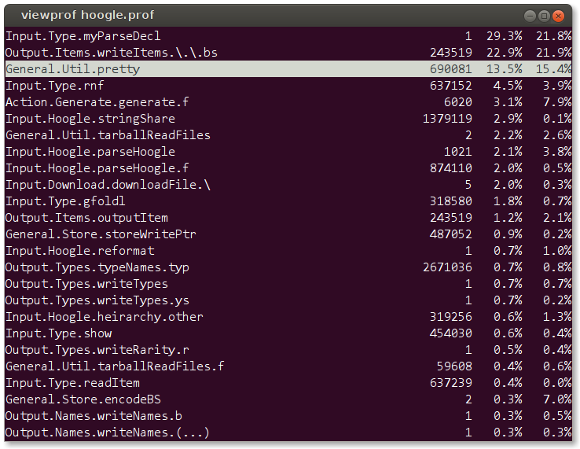

# viewprof
[](https://hackage.haskell.org/package/viewprof)
[](http://packdeps.haskellers.com/feed?needle=viewprof)
[](http://stackage.org/lts/package/viewprof)
[](http://stackage.org/nightly/package/viewprof)
[](https://travis-ci.org/maoe/viewprof)

viewprof is a text-based interactive GHC .prof viewer.



It has three display modes:

* __Aggregate cost centers view__: This is the default view. It groups cost centers by their name and module name, like the middle section of .prof files.
* __Call sites view__: If you press enter on a cost center, viewprof displays call sites of the cost center you selected. This view tells how much the cost center spent for each call site.
* __Modules view__: If you press M, viewprof displays the module level breakdown. This view tells coarse overview of cost attribution.

## Installation

```
stack install viewprof
```

### On Windows

#### Prerequisites

- [Docker for Windows](https://docs.docker.com/docker-for-windows/install/) or [Docker Toolbox](https://docs.docker.com/toolbox/overview/).
    - Currently tried with: [Docker Toolbox v17.04.0ce](https://github.com/docker/toolbox/releases/tag/v17.04.0-ce) on Windows 10 Home.
- [cygpath](https://cygwin.com/cygwin-ug-net/cygpath.html)
    - Bundled with [Cygwin](https://www.cygwin.com/), [MSYS2](http://www.msys2.org/) etc.

#### How to install and launch

```bash
$ git clone git@github.com:maoe/viewprof.git
$ cd viewprof/docker
$ docker-machine start
$ docker build -t viewprof .
$ .\viewprof.bat path/to/file.prof
```

## Usage

| keys              | action                                      |
|-------------------|---------------------------------------------|
| `q` or `escape`   | quit the current view                       |
| `j` or `↓`        | move focus down     　 　　　　　　           |
| `k` or `↑`        | move focus up         　　　　　　　          |
| `gg`              | move focus to the top                       |
| `G`               | move focus to the bottom                    |
| `C`               | display aggregate cost center view          |
| `M`               | switch to module breakdown                  |
| `enter`           | select a cost center and display call sites |
| `t`               | sort by time                                |
| `a`               | sort by allocation                          |
| `e`               | sort by # of entries                        |
| `h` or `?`        | show key bindings                           |
| `i`               | show profile information                    |

## Acknowledgement

`viewprof` was originally meant to be a Haskell port of [mkotha/viewprof](https://github.com/mkotha/viewprof), which is a text-based .prof viewer written in Common Lisp.
